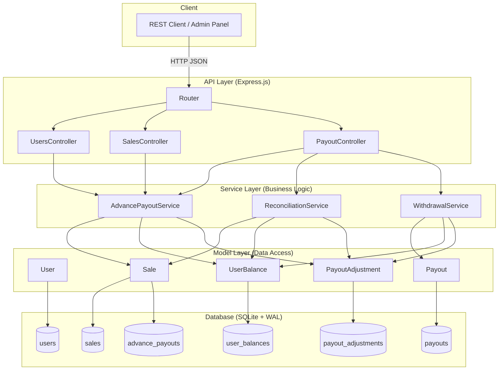
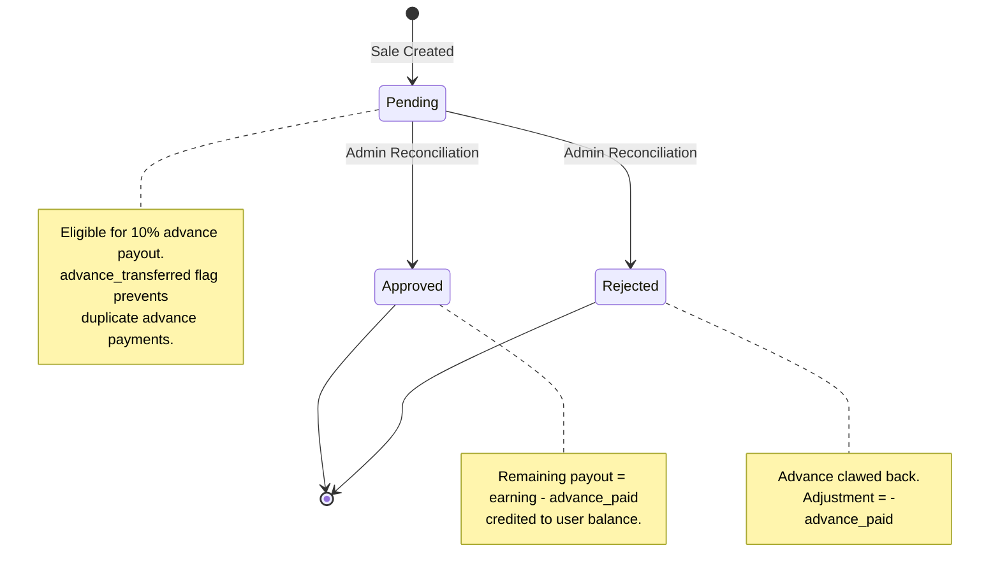
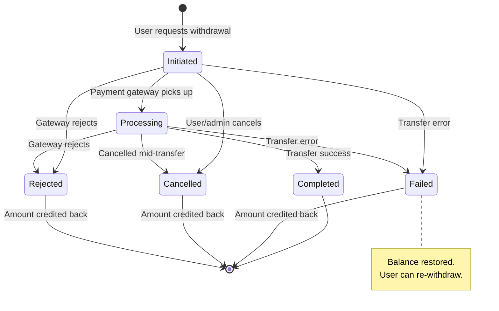
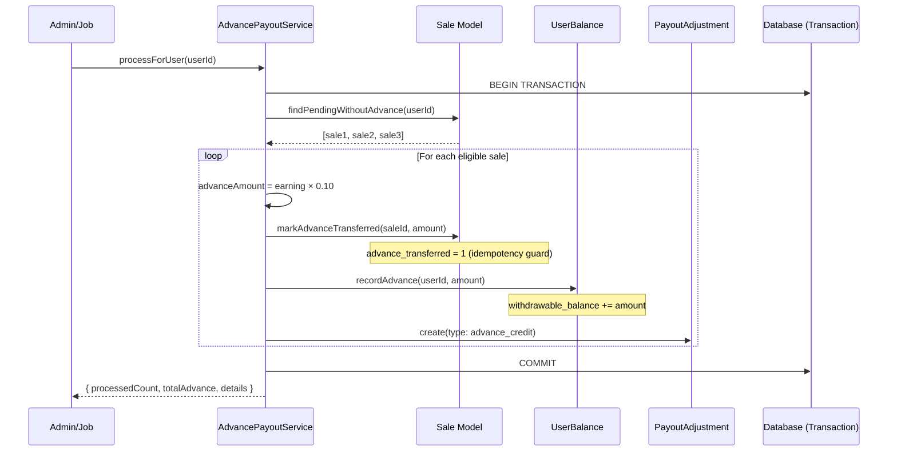
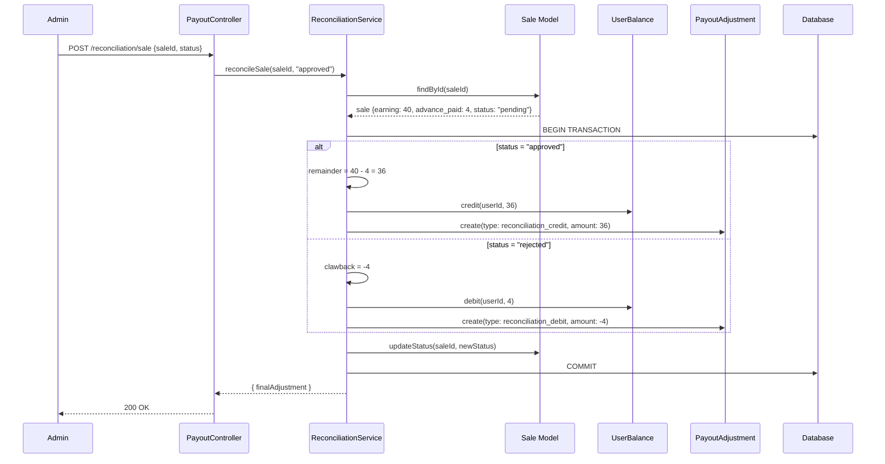
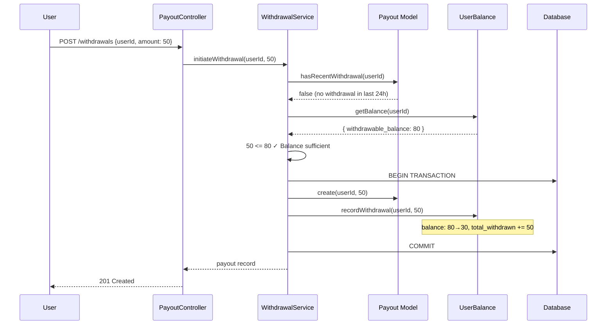
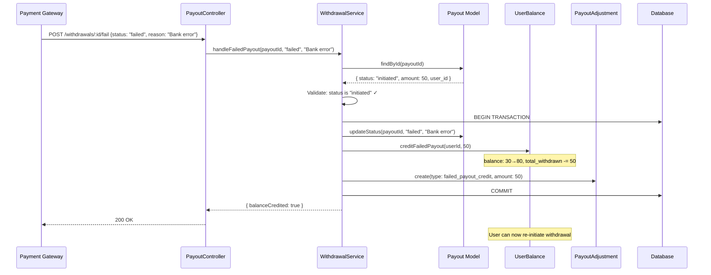
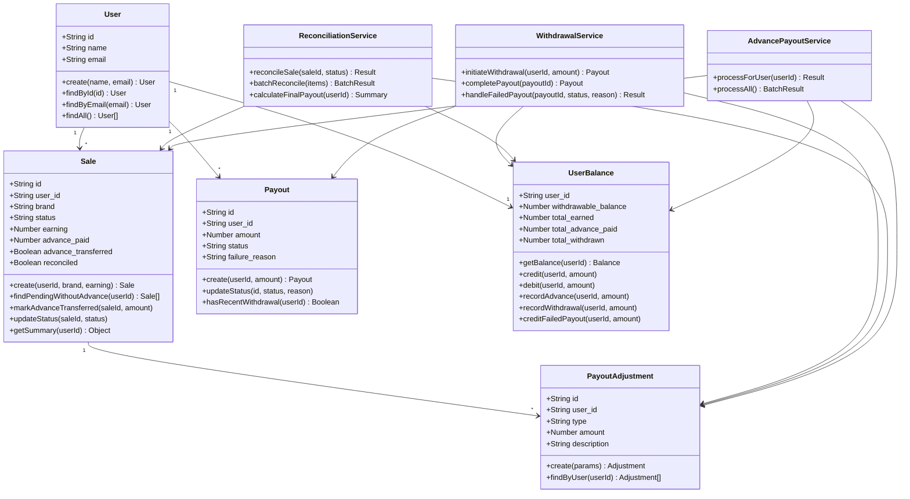

# Low-Level Design (LLD) — User Payout Management System

> **Author:** Harsh Kumar Sharma  
> **Language:** JavaScript (Node.js)  
> **Database:** SQLite  
> **Purpose:** Technical Assessment — SDE Intern

---

## 1. Problem Statement Summary

Build a system to manage affiliate sale payouts with:
- 10% advance payouts on pending sales (idempotent)
- Admin reconciliation (approve/reject) with advance adjustment
- 24-hour withdrawal rate limiting
- Failed payout recovery (credit back to balance)

---

## 2. High-Level Architecture



### Layer Responsibilities

| Layer | Role | Principle |
|-------|------|-----------|
| **Routes** | URL → Controller mapping | Single Responsibility |
| **Controllers** | Input validation, HTTP status codes, response shaping | Thin — no business logic |
| **Services** | Business rules, transaction orchestration, multi-model coordination | All domain logic lives here |
| **Models** | Single-table CRUD, SQL queries, data retrieval | No cross-table awareness |
| **Database** | Schema, constraints, indexes, referential integrity | Data integrity at DB level |

**Why this layering?**  
Controller doesn't know about transactions. Service doesn't know about HTTP. Model doesn't know about business rules. Each layer can be tested and replaced independently.

---

## 3. Entity-Relationship Diagram

```mermaid
erDiagram
    users ||--o{ sales : "has many"
    users ||--o{ payouts : "requests"
    users ||--|| user_balances : "has one"
    users ||--o{ payout_adjustments : "receives"
    sales ||--o{ advance_payouts : "may receive"
    sales ||--o{ payout_adjustments : "triggers"
    payouts ||--o{ payout_adjustments : "may trigger"

    users {
        TEXT id PK
        TEXT name
        TEXT email UK
        TEXT created_at
        TEXT updated_at
    }

    sales {
        TEXT id PK
        TEXT user_id FK
        TEXT brand "brand_1 | brand_2 | brand_3"
        TEXT status "pending | approved | rejected"
        REAL earning "CHECK >= 0"
        REAL advance_paid "DEFAULT 0"
        INT advance_transferred "0 or 1 (boolean)"
        INT reconciled "0 or 1 (boolean)"
        TEXT created_at
        TEXT updated_at
    }

    advance_payouts {
        TEXT id PK
        TEXT sale_id FK
        TEXT user_id FK
        REAL amount
        TEXT transferred_at
    }

    payouts {
        TEXT id PK
        TEXT user_id FK
        REAL amount "CHECK > 0"
        TEXT status "initiated | processing | completed | failed | cancelled | rejected"
        TEXT failure_reason "nullable"
        TEXT initiated_at
        TEXT completed_at "nullable"
    }

    payout_adjustments {
        TEXT id PK
        TEXT user_id FK
        TEXT sale_id FK "nullable"
        TEXT payout_id FK "nullable"
        TEXT type "advance_credit | reconciliation_credit | reconciliation_debit | failed_payout_credit"
        REAL amount
        TEXT description "nullable"
        TEXT created_at
    }

    user_balances {
        TEXT user_id PK_FK
        REAL withdrawable_balance "DEFAULT 0"
        REAL total_earned "DEFAULT 0"
        REAL total_advance_paid "DEFAULT 0"
        REAL total_withdrawn "DEFAULT 0"
        TEXT last_withdrawal_at "nullable"
    }
```

---

## 4. Database Schema Details

### Indexes (for query performance)

```sql
CREATE INDEX idx_sales_user_status    ON sales(user_id, status);      -- advance payout lookups
CREATE INDEX idx_sales_status         ON sales(status);               -- batch reconciliation
CREATE INDEX idx_advance_payouts_sale ON advance_payouts(sale_id);    -- idempotency check
CREATE INDEX idx_payouts_user         ON payouts(user_id);            -- withdrawal history
CREATE INDEX idx_payouts_status       ON payouts(status);             -- failed payout queries
CREATE INDEX idx_adjustments_user     ON payout_adjustments(user_id); -- audit trail
```

### Why These Indexes?

| Index | Justification |
|-------|--------------|
| `(user_id, status)` on sales | Composite index — advance job queries `WHERE user_id = ? AND status = 'pending'` |
| `(status)` on sales | Batch advance job scans all pending sales |
| `(sale_id)` on advance_payouts | Fast lookup to check if advance already paid |
| `(user_id)` on payouts | 24-hour restriction check per user |
| `(user_id)` on adjustments | Fetching audit trail per user |

---

## 5. State Machine Diagrams

### 5.1 Sale Status Lifecycle



### 5.2 Payout (Withdrawal) Status Lifecycle



---

## 6. Sequence Diagrams — Core Workflows

### 6.1 Advance Payout Processing



**Idempotency guarantee:** If this job runs again, `findPendingWithoutAdvance` returns only sales where `advance_transferred = 0`. Previously processed sales are skipped.

### 6.2 Reconciliation (Approve/Reject)



### 6.3 Withdrawal with 24-Hour Check



### 6.4 Failed Payout Recovery (Question 2)



---

## 7. Complete Example Walkthrough (from Problem Statement)

```mermaid
graph LR
    subgraph Step1["Step 1: Create 3 Sales"]
        S1["Sale 1: ₹40 (pending)"]
        S2["Sale 2: ₹40 (pending)"]
        S3["Sale 3: ₹40 (pending)"]
    end

    subgraph Step2["Step 2: Advance Payout (10%)"]
        A1["Sale 1: advance ₹4"]
        A2["Sale 2: advance ₹4"]
        A3["Sale 3: advance ₹4"]
        BAL1["Balance = ₹12"]
    end

    subgraph Step3["Step 3: Reconciliation"]
        R1["Sale 1 → REJECTED: -₹4"]
        R2["Sale 2 → APPROVED: +₹36"]
        R3["Sale 3 → APPROVED: +₹36"]
        BAL2["Balance = ₹80"]
    end

    Step1 --> Step2 --> Step3
```



### Step-by-Step Balance Trace

| Step | Action | Balance Change | Running Balance |
|------|--------|---------------|-----------------|
| 0 | User created | — | ₹0 |
| 1 | Advance on Sale 1 (₹40 × 10%) | +₹4 | ₹4 |
| 2 | Advance on Sale 2 (₹40 × 10%) | +₹4 | ₹8 |
| 3 | Advance on Sale 3 (₹40 × 10%) | +₹4 | ₹12 |
| 4 | Sale 1 REJECTED → clawback advance | −₹4 | ₹8 |
| 5 | Sale 2 APPROVED → credit remainder (₹40 − ₹4) | +₹36 | ₹44 |
| 6 | Sale 3 APPROVED → credit remainder (₹40 − ₹4) | +₹36 | ₹80 |

**Final Payout (post-reconciliation) = −₹4 + ₹36 + ₹36 = ₹68**  
**Total Withdrawable Balance = ₹80** (includes ₹12 advance already credited)

> The ₹68 "Final Payout" from the problem statement is what remains AFTER accounting for the ₹12 advance already paid. Our system's ₹80 balance is correct — it represents the total the user can withdraw if they haven't withdrawn anything yet.

---

## 8. Class Design (UML-style)



---

## 9. API Endpoints — Complete Reference

### Users
| Method | Endpoint | Body | Response |
|--------|----------|------|----------|
| POST | `/api/users` | `{ name, email }` | `201: { success, data: User }` |
| GET | `/api/users` | — | `200: { success, data: User[] }` |
| GET | `/api/users/:id` | — | `200: { success, data: User }` |

### Sales
| Method | Endpoint | Body | Response |
|--------|----------|------|----------|
| POST | `/api/sales` | `{ userId, brand, earning }` | `201: { success, data: Sale }` |
| GET | `/api/sales/:id` | — | `200: { success, data: Sale }` |
| GET | `/api/users/:userId/sales` | — | `200: { success, data: { sales, summary } }` |

### Advance Payouts
| Method | Endpoint | Body | Response |
|--------|----------|------|----------|
| POST | `/api/advance-payouts/process/:userId` | — | `200: { processedCount, totalAdvance, details }` |
| POST | `/api/advance-payouts/process-all` | — | `200: { usersProcessed, totalAdvances }` |

### Reconciliation
| Method | Endpoint | Body | Response |
|--------|----------|------|----------|
| POST | `/api/reconciliation/sale` | `{ saleId, status }` | `200: { finalAdjustment, ... }` |
| POST | `/api/reconciliation/batch` | `{ reconciliations: [{saleId, status}] }` | `200: { processed, failed, results }` |
| GET | `/api/reconciliation/summary/:userId` | — | `200: { salesBreakdown, totalFinalPayout }` |

### Withdrawals
| Method | Endpoint | Body | Response |
|--------|----------|------|----------|
| POST | `/api/withdrawals` | `{ userId, amount }` | `201: { success, data: Payout }` |
| POST | `/api/withdrawals/:id/complete` | — | `200: { success, data: Payout }` |
| POST | `/api/withdrawals/:id/fail` | `{ status, reason? }` | `200: { balanceCredited: true }` |
| GET | `/api/withdrawals/:userId/history` | — | `200: { success, data: Payout[] }` |

### Balance
| Method | Endpoint | Body | Response |
|--------|----------|------|----------|
| GET | `/api/balance/:userId` | — | `200: { withdrawable_balance, total_earned, ... }` |

---

## 10. Edge Cases & Failure Handling

| # | Edge Case | Handling Strategy | Code Location |
|---|-----------|-------------------|---------------|
| 1 | Advance job runs multiple times | `advance_transferred` boolean flag (idempotent) | `AdvancePayoutService.processForUser()` |
| 2 | Sale reconciled twice | Status guard: only `pending` → `approved/rejected` | `ReconciliationService.reconcileSale()` |
| 3 | Withdrawal within 24 hours | `hasRecentWithdrawal()` checks timestamp window | `WithdrawalService.initiateWithdrawal()` |
| 4 | Insufficient balance | Pre-debit balance check with descriptive error | `WithdrawalService.initiateWithdrawal()` |
| 5 | Marking completed payout as failed | Status guard: only `initiated/processing` can fail | `WithdrawalService.handleFailedPayout()` |
| 6 | Negative balance after clawback | Allowed (debt tracking); withdrawals blocked at ≤ 0 | `UserBalance.debit()` |
| 7 | Sale reconciled before advance runs | `advance_paid = 0`, so approved → full credit, rejected → no clawback | `ReconciliationService.reconcileSale()` |
| 8 | Zero-earning sale | 10% of 0 = 0; advance recorded but no money moves | `AdvancePayoutService` |
| 9 | Partial batch reconciliation failure | Errors collected per-sale; successful ones still commit | `ReconciliationService.batchReconcile()` |
| 10 | Concurrent advance + withdrawal | SQLite serialized writes + transactions prevent race conditions | Database WAL mode |

---

## 11. Design Decisions & Trade-offs

### 11.1 Materialized Balance vs. Computed-on-Read

| Approach | Read Cost | Write Cost | Consistency Risk |
|----------|-----------|------------|-----------------|
| **Materialized (chosen)** | O(1) | O(1) per update | Drift possible if write missed |
| Computed from adjustments | O(n) | O(1) insert only | Always consistent |

**Decision:** Materialized. Payout dashboards check balance on every page load. O(1) reads are critical. The `payout_adjustments` audit trail serves as a fallback to reconstruct the true balance if drift is ever suspected.

### 11.2 Per-Sale vs. Aggregate Advance Tracking

**Decision:** Per-sale (`advance_transferred` flag + `advance_paid` amount on each sale).  
**Why:** During reconciliation, we need to know exactly how much advance was paid for *this specific sale* to calculate the correct remainder (approved) or clawback (rejected). Aggregate tracking would require proportional splitting, which is error-prone.

### 11.3 Transaction Boundaries

**Decision:** Each service method wraps its entire operation in a single database transaction.  
**Why:** Atomicity. If crediting the balance succeeds but the audit record fails, the system is in an inconsistent state. The transaction ensures all-or-nothing.

### 11.4 Immutable Audit Trail

**Decision:** `payout_adjustments` is append-only. No UPDATE or DELETE ever.  
**Why:** Financial regulation compliance pattern. Every balance change has a traceable record. Enables dispute resolution, balance reconstruction, and forensic auditing.

### 11.5 SQLite for Demonstration

**Decision:** SQLite instead of PostgreSQL/MongoDB.  
**Why:** Reviewer can `npm install && npm start` with zero external dependencies.  
**Production migration:** Replace `src/config/database.js` with a PostgreSQL connection pool. All SQL is standard and portable. The layered architecture ensures no other file needs to change.

---

## 12. Production Considerations

If this were production, I would add:

| Concern | Solution |
|---------|----------|
| **Database** | PostgreSQL with connection pooling (pg-pool) |
| **Concurrency** | Row-level locking (`SELECT ... FOR UPDATE`) on balance reads |
| **Advance Job** | Cron-based scheduler (node-cron) or message queue (Bull/BullMQ) |
| **Authentication** | JWT-based auth middleware on all endpoints |
| **Rate Limiting** | express-rate-limit middleware per IP/user |
| **Monitoring** | Structured logging (pino), APM (Datadog/New Relic) |
| **Failed Payout Retry** | Exponential backoff retry queue with dead-letter |
| **Balance Reconciliation** | Periodic job comparing materialized balance vs. sum of adjustments |
| **API Versioning** | `/api/v1/` prefix for backward compatibility |
