# Low-Level Design (LLD) — User Payout Management System

> **Author:** Harsh Kumar Sharma  
> **Language:** JavaScript (Node.js)  
> **Database:** SQLite  
> **Purpose:** Technical Assessment — SDE Intern

---

## 1. Problem Statement Summary

Build a system to manage affiliate sale payouts with:
- 10% advance payouts on pending sales (idempotent)
- Admin reconciliation (approve/reject) with advance adjustment
- 24-hour withdrawal rate limiting
- Failed payout recovery (credit back to balance)

---

## 2. High-Level Architecture

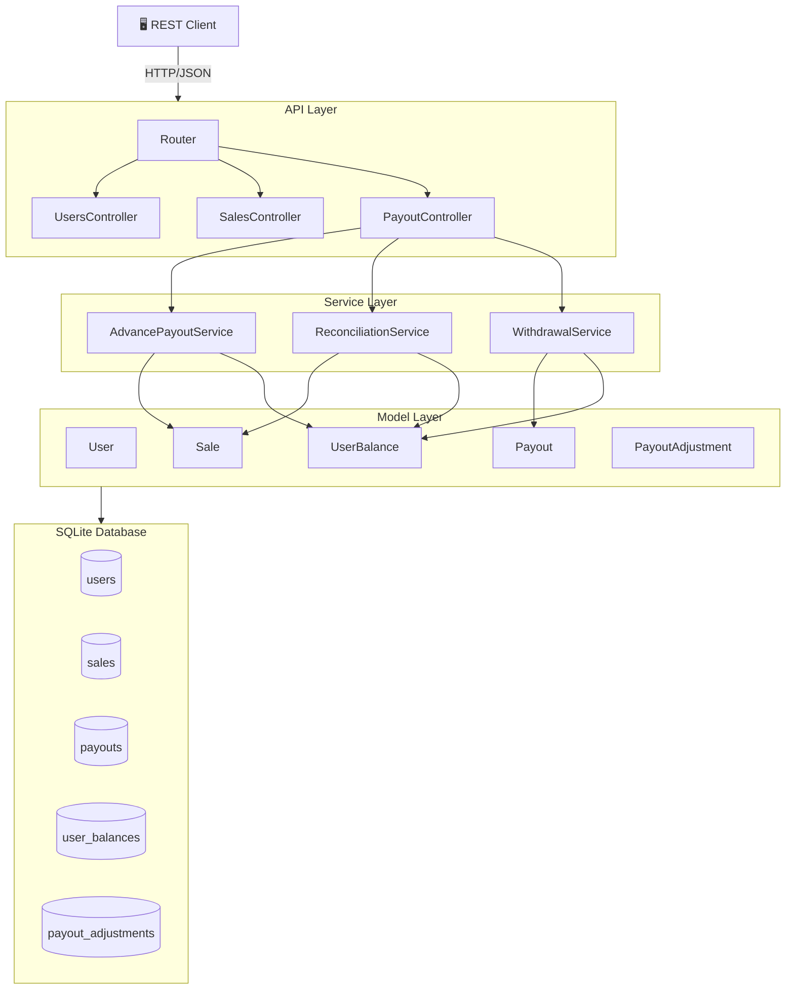

### Layer Responsibilities

| Layer | Role | Principle |
|-------|------|-----------|
| **Routes** | URL → Controller mapping | Single Responsibility |
| **Controllers** | Input validation, HTTP status codes, response shaping | Thin — no business logic |
| **Services** | Business rules, transaction orchestration, multi-model coordination | All domain logic lives here |
| **Models** | Single-table CRUD, SQL queries, data retrieval | No cross-table awareness |
| **Database** | Schema, constraints, indexes, referential integrity | Data integrity at DB level |

**Why this layering?**  
Controller doesn't know about transactions. Service doesn't know about HTTP. Model doesn't know about business rules. Each layer can be tested and replaced independently.

---

## 3. Entity-Relationship Diagram

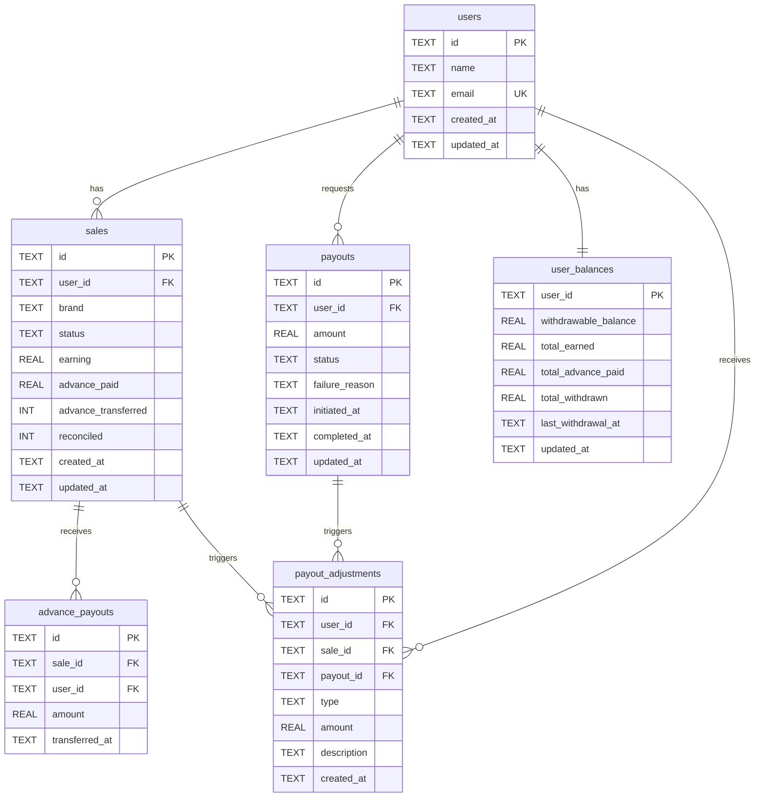

**Column constraints** (enforced at DB level):

| Table | Column | Constraint |
|-------|--------|------------|
| sales | brand | `CHECK IN (brand_1, brand_2, brand_3)` |
| sales | status | `CHECK IN (pending, approved, rejected)` |
| sales | earning | `CHECK >= 0` |
| sales | advance_transferred | `0` (no) or `1` (yes) — idempotency flag |
| payouts | amount | `CHECK > 0` |
| payouts | status | `CHECK IN (initiated, processing, completed, failed, cancelled, rejected)` |
| payout_adjustments | type | `CHECK IN (advance_credit, reconciliation_credit, reconciliation_debit, failed_payout_credit)` |
| user_balances | all REAL columns | `DEFAULT 0` |

---

## 4. Database Schema Details

### Indexes (for query performance)

```sql
CREATE INDEX idx_sales_user_status    ON sales(user_id, status);
CREATE INDEX idx_sales_status         ON sales(status);
CREATE INDEX idx_advance_payouts_sale ON advance_payouts(sale_id);
CREATE INDEX idx_payouts_user         ON payouts(user_id);
CREATE INDEX idx_payouts_status       ON payouts(status);
CREATE INDEX idx_adjustments_user     ON payout_adjustments(user_id);
```

### Why These Indexes?

| Index | Query It Speeds Up |
|-------|--------------------|
| `(user_id, status)` on sales | Advance job: `WHERE user_id = ? AND status = 'pending'` |
| `(status)` on sales | Batch job scanning all pending sales |
| `(sale_id)` on advance_payouts | Checking if advance already paid |
| `(user_id)` on payouts | 24-hour restriction check per user |
| `(user_id)` on adjustments | Fetching audit trail per user |

---

## 5. State Machine Diagrams

### 5.1 Sale Status Lifecycle

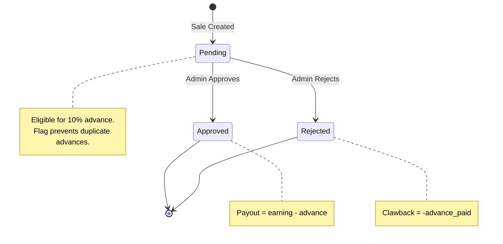

### 5.2 Payout (Withdrawal) Status Lifecycle

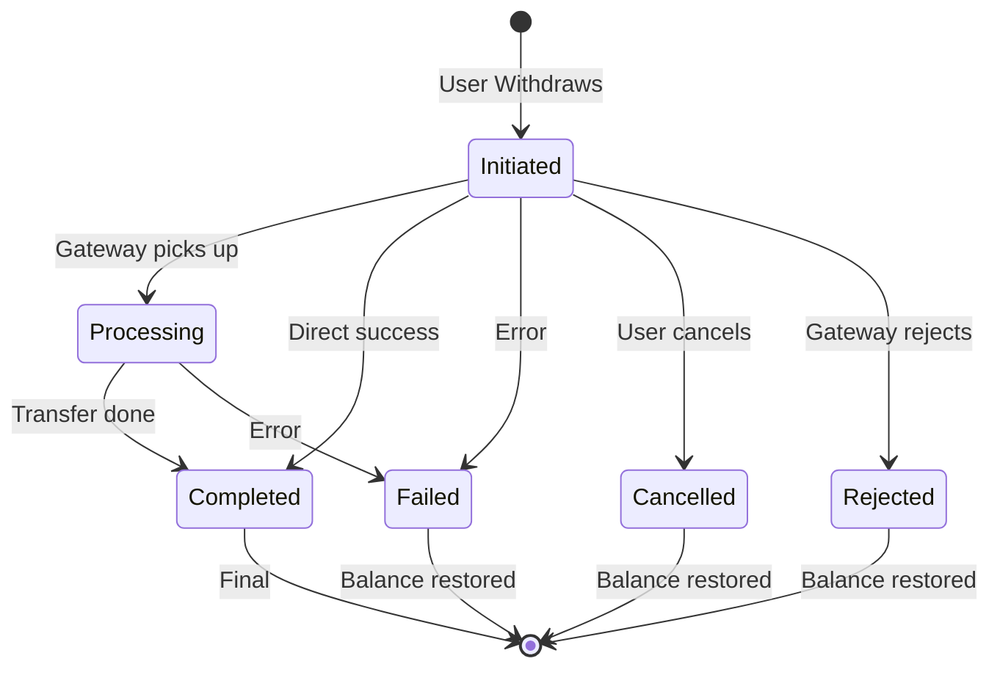

---

## 6. Core Workflow Diagrams

### 6.1 Advance Payout Flow

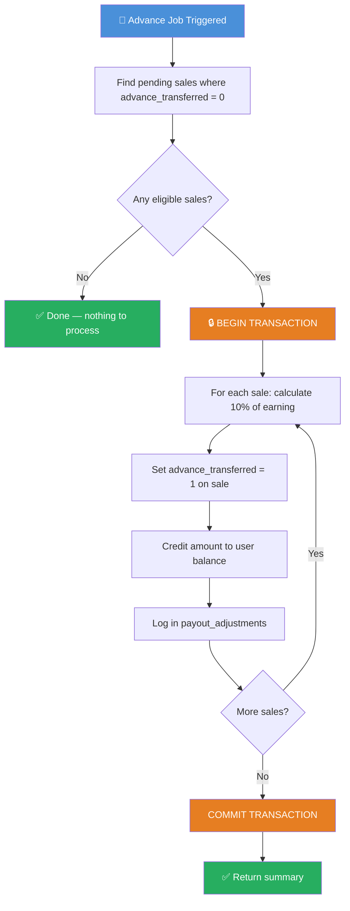

**Idempotency:** If this job runs again, step B filters out already-processed sales (where `advance_transferred = 1`). No double-payment ever.

### 6.2 Reconciliation Flow

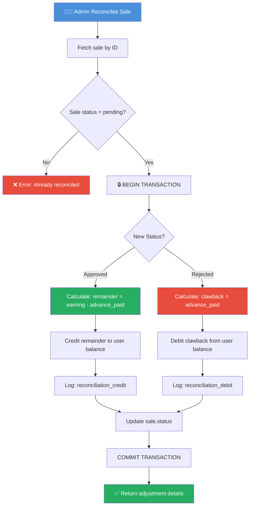

### 6.3 Withdrawal Flow

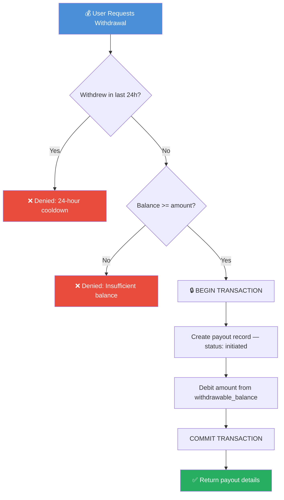

### 6.4 Failed Payout Recovery (Question 2)

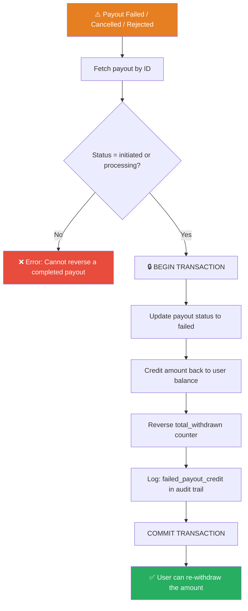

---

## 7. Sequence Diagrams (Detailed Interactions)

### 7.1 Advance Payout — Component Interaction

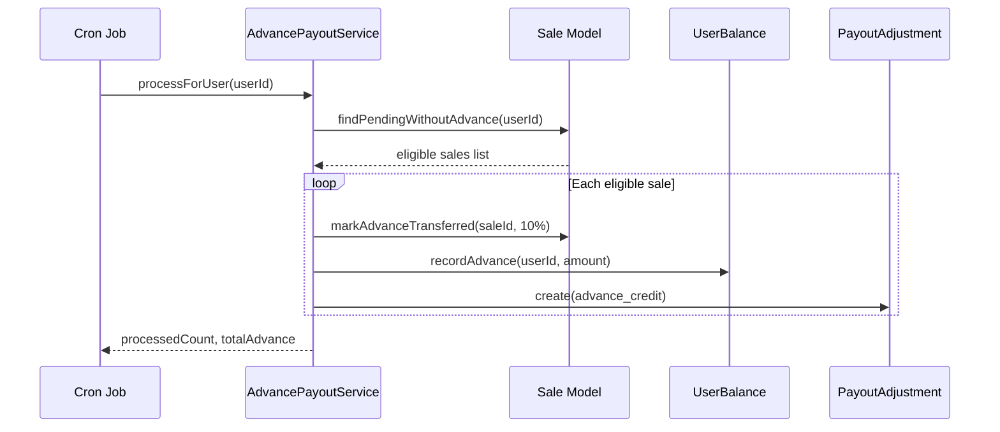

### 7.2 Reconciliation — Component Interaction

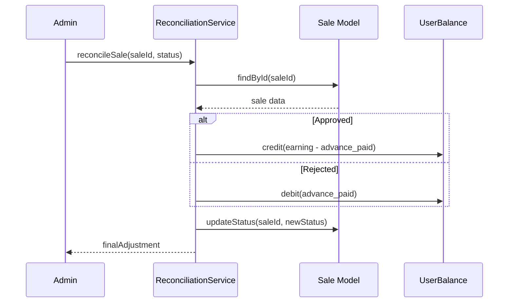

### 7.3 Failed Payout Recovery — Component Interaction

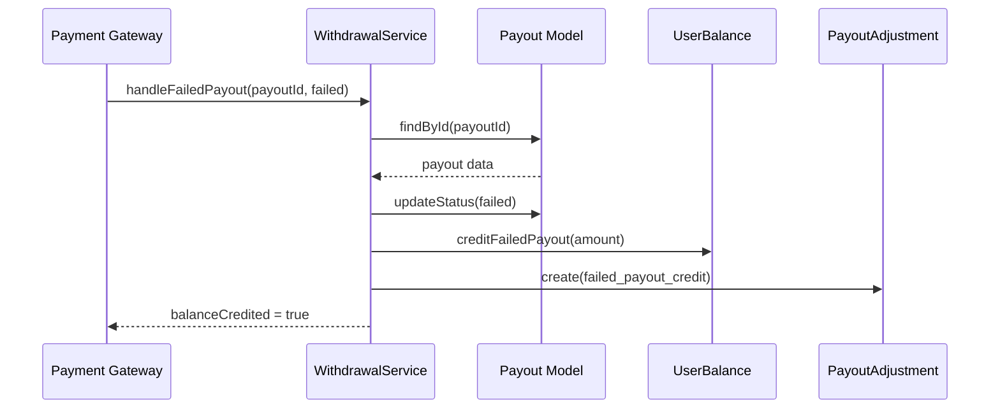

---

## 8. Complete Example Walkthrough (from Problem Statement)

### Sale A Journey (REJECTED)

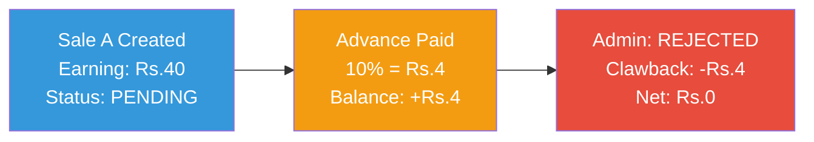

### Sale B Journey (APPROVED)


### Sale C Journey (APPROVED)

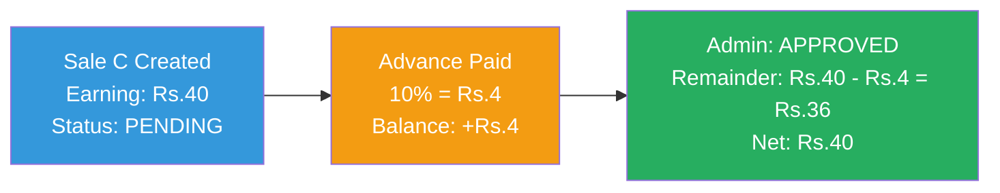

### Combined Result

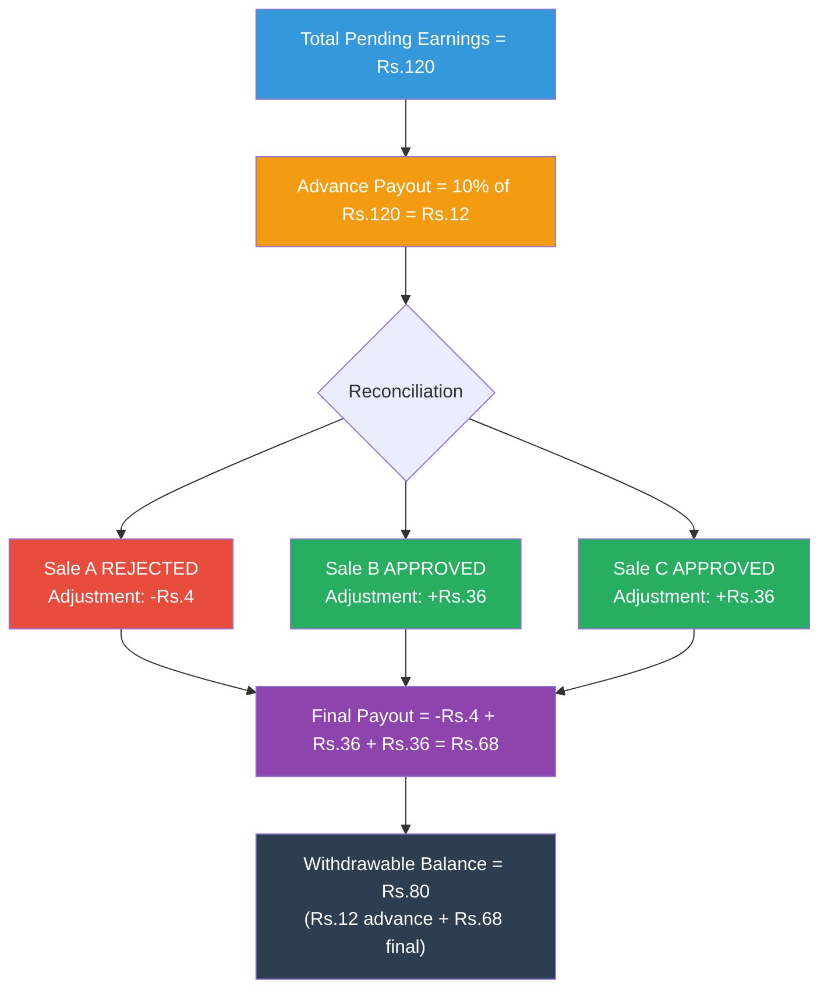

### Step-by-Step Balance Trace

| Step | Action | Change | Balance |
|:----:|--------|:------:|:-------:|
| 0 | User created | — | **Rs.0** |
| 1 | Advance on Sale A (Rs.40 x 10%) | +Rs.4 | **Rs.4** |
| 2 | Advance on Sale B (Rs.40 x 10%) | +Rs.4 | **Rs.8** |
| 3 | Advance on Sale C (Rs.40 x 10%) | +Rs.4 | **Rs.12** |
| 4 | Sale A **REJECTED** → clawback advance | -Rs.4 | **Rs.8** |
| 5 | Sale B **APPROVED** → credit remainder (Rs.40 - Rs.4) | +Rs.36 | **Rs.44** |
| 6 | Sale C **APPROVED** → credit remainder (Rs.40 - Rs.4) | +Rs.36 | **Rs.80** |

**Final Payout (post-reconciliation) = -Rs.4 + Rs.36 + Rs.36 = Rs.68**  
**Total Withdrawable Balance = Rs.80** (includes Rs.12 advance already credited)

> The Rs.68 "Final Payout" from the problem statement is what remains AFTER accounting for the Rs.12 advance already paid. Our system's Rs.80 balance is correct — it represents the total the user can withdraw if they haven't withdrawn anything yet.

---

## 9. Class Design

### 9.1 Models (Data Access Layer)

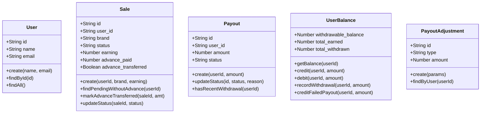

### 9.2 Service → Model Dependency Map

Each service orchestrates multiple models inside a single database transaction.

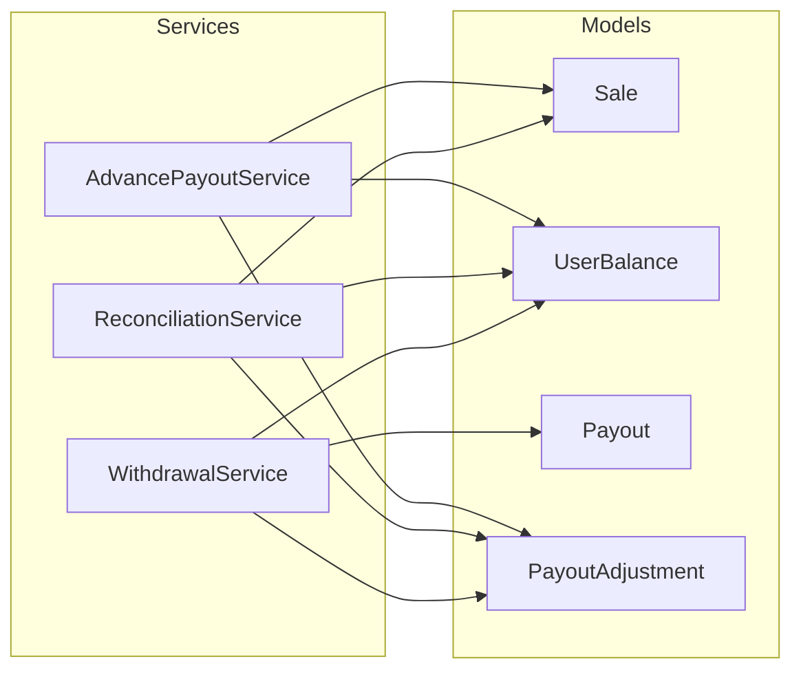

### 9.3 Data Ownership (User → Entities)

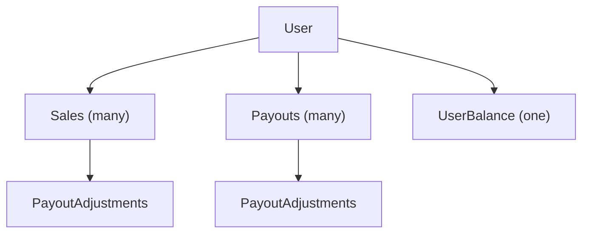

**Key observations:**
- All 3 services depend on `UserBalance` — it is the central model
- All 3 services log to `PayoutAdjustment` — the immutable audit trail
- `AdvancePayoutService` and `ReconciliationService` share access to `Sale`
- Only `WithdrawalService` accesses `Payout`

---

## 10. API Endpoints — Complete Reference

### Users
| Method | Endpoint | Body | Response |
|--------|----------|------|----------|
| POST | `/api/users` | `{ name, email }` | `201: { success, data: User }` |
| GET | `/api/users` | — | `200: { success, data: User[] }` |
| GET | `/api/users/:id` | — | `200: { success, data: User }` |

### Sales
| Method | Endpoint | Body | Response |
|--------|----------|------|----------|
| POST | `/api/sales` | `{ userId, brand, earning }` | `201: { success, data: Sale }` |
| GET | `/api/sales/:id` | — | `200: { success, data: Sale }` |
| GET | `/api/users/:userId/sales` | — | `200: { success, data: { sales, summary } }` |

### Advance Payouts
| Method | Endpoint | Body | Response |
|--------|----------|------|----------|
| POST | `/api/advance-payouts/process/:userId` | — | `200: { processedCount, totalAdvance, details }` |
| POST | `/api/advance-payouts/process-all` | — | `200: { usersProcessed, totalAdvances }` |

### Reconciliation
| Method | Endpoint | Body | Response |
|--------|----------|------|----------|
| POST | `/api/reconciliation/sale` | `{ saleId, status }` | `200: { finalAdjustment, ... }` |
| POST | `/api/reconciliation/batch` | `{ reconciliations: [{saleId, status}] }` | `200: { processed, failed, results }` |
| GET | `/api/reconciliation/summary/:userId` | — | `200: { salesBreakdown, totalFinalPayout }` |

### Withdrawals
| Method | Endpoint | Body | Response |
|--------|----------|------|----------|
| POST | `/api/withdrawals` | `{ userId, amount }` | `201: { success, data: Payout }` |
| POST | `/api/withdrawals/:id/complete` | — | `200: { success, data: Payout }` |
| POST | `/api/withdrawals/:id/fail` | `{ status, reason? }` | `200: { balanceCredited: true }` |
| GET | `/api/withdrawals/:userId/history` | — | `200: { success, data: Payout[] }` |

### Balance
| Method | Endpoint | Body | Response |
|--------|----------|------|----------|
| GET | `/api/balance/:userId` | — | `200: { withdrawable_balance, total_earned, ... }` |

---

## 11. Edge Cases & Failure Handling

| # | Edge Case | Handling Strategy |
|---|-----------|-------------------|
| 1 | Advance job runs multiple times | `advance_transferred` flag — idempotent |
| 2 | Sale reconciled twice | Status guard: only `pending` can transition |
| 3 | Withdrawal within 24 hours | Timestamp check on recent payouts |
| 4 | Insufficient balance | Pre-debit balance check with error |
| 5 | Completed payout marked as failed | Status guard: only `initiated/processing` can fail |
| 6 | Negative balance after clawback | Allowed as debt; withdrawals blocked at 0 |
| 7 | Reconciliation before advance runs | No clawback needed; full amount credited |
| 8 | Zero-earning sale | 10% of 0 = 0; recorded but no money moves |
| 9 | Batch reconciliation partial failure | Per-sale error collection; successes still commit |
| 10 | Server crash mid-operation | DB transaction auto-rollback; no partial state |

---

## 12. Design Decisions & Trade-offs

### 12.1 Materialized Balance vs. Computed-on-Read

| Approach | Read Cost | Write Cost | Consistency Risk |
|----------|-----------|------------|-----------------|
| **Materialized (chosen)** | O(1) | O(1) per update | Drift possible |
| Computed from adjustments | O(n) | O(1) insert only | Always consistent |

**Decision:** Materialized. Payout dashboards check balance on every page load. O(1) reads are critical. The `payout_adjustments` audit trail exists as a fallback to reconstruct the true balance if drift is suspected.

### 12.2 Per-Sale vs. Aggregate Advance Tracking

**Decision:** Per-sale (`advance_transferred` flag + `advance_paid` amount on each sale).  
**Why:** During reconciliation, we need to know exactly how much advance was paid for *this specific sale* to calculate the correct remainder or clawback. Aggregate tracking would require proportional splitting, which is error-prone.

### 12.3 Transaction Boundaries

**Decision:** Each service method wraps its entire operation in a single database transaction.  
**Why:** Atomicity. If crediting the balance succeeds but the audit record fails, the system is inconsistent. The transaction ensures all-or-nothing.

### 12.4 Immutable Audit Trail

**Decision:** `payout_adjustments` is append-only. No UPDATE or DELETE ever.  
**Why:** Financial systems require full traceability. Every balance change has a traceable record. Enables dispute resolution, balance reconstruction, and forensic auditing.

### 12.5 SQLite for Demonstration

**Decision:** SQLite instead of PostgreSQL/MongoDB.  
**Why:** Reviewer can `npm install && npm start` with zero external dependencies.  
**Production migration:** Replace `src/config/database.js` with a PostgreSQL connection pool. All SQL is standard and portable. The layered architecture ensures no other file needs to change.

---

## 13. Production Considerations

If this were production, I would add:

| Concern | Solution |
|---------|----------|
| **Database** | PostgreSQL with connection pooling |
| **Concurrency** | Row-level locking (`SELECT ... FOR UPDATE`) |
| **Advance Job** | Cron scheduler or message queue (BullMQ) |
| **Authentication** | JWT-based auth middleware |
| **Rate Limiting** | express-rate-limit per IP/user |
| **Monitoring** | Structured logging (pino), APM |
| **Failed Payout Retry** | Exponential backoff with dead-letter queue |
| **Balance Reconciliation** | Periodic job: materialized vs. sum of adjustments |
| **API Versioning** | `/api/v1/` prefix for backward compatibility |
